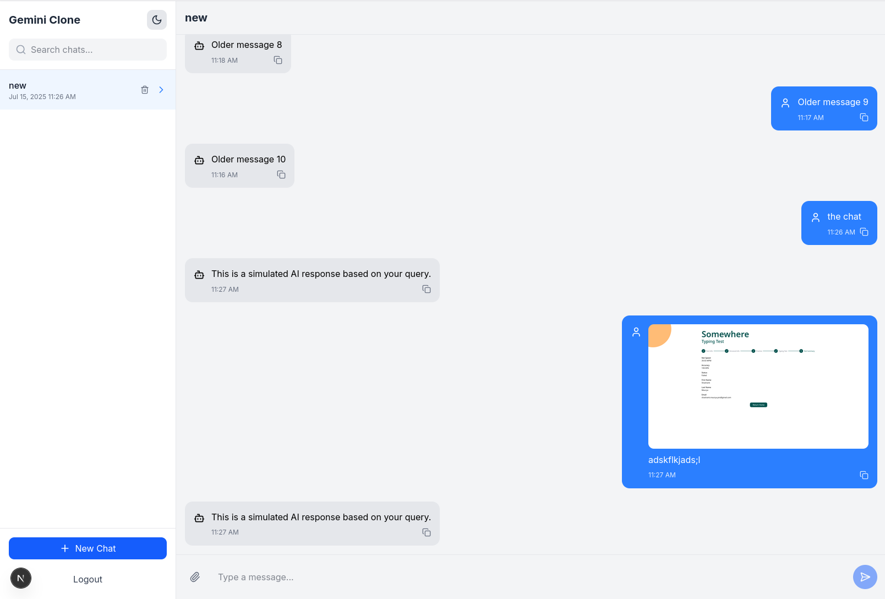

# Gemini Clone - Frontend Assignment



A fully functional, responsive frontend clone of a Gemini-style conversational AI chat application built for Kuvaka Tech's frontend developer assignment.

## Features

- ✅ OTP-based authentication with country code selection
- ✅ Chatroom management (create, delete, search)
- ✅ Real-time chat interface with typing indicators
- ✅ AI response simulation with throttling
- ✅ Image upload and preview
- ✅ Infinite scroll message loading
- ✅ Copy-to-clipboard functionality
- ✅ Dark/light mode toggle
- ✅ Responsive design for all devices
- ✅ Toast notifications for user actions

## Live Demo

[View Live Demo on Vercel](https://gemini-clone-kuvaka.vercel.app)

## Tech Stack

- **Framework**: Next.js 15 (App Router)
- **State Management**: Zustand
- **Form Handling**: React Hook Form + Zod
- **Styling**: Tailwind CSS
- **UI Components**: Shadcn UI + Lucide Icons
- **Notifications**: react-hot-toast
- **Date Formatting**: date-fns
- **Deployment**: Vercel

## Project Structure

```bash
src/
├── app/                   # Application routes
├── components/            # Reusable components
├── hooks/                 # Custom React hooks
├── lib/                   # Libraries and utilities
├── types/                 # TypeScript type definitions
├── styles/                # Global styles
└── public/                # Static assets

## Commands

npx create-next-app@latest ./
npm install zustand react-hook-form zod @hookform/resolvers tailwindcss postcss autoprefixer
npm install @radix-ui/react-toast lucide-react
npx shadcn-ui@latest init

## Directory Tree

/src
├── /app # Main app routes and layouts
│ ├── /layout.tsx # Root layout for the application
│ ├── /(auth) # Auth-related routes
│ │ └── /login
│ │ ├── page.tsx # Login page
│ │ └── otp-verification.tsx # OTP verification page
│ └── /dashboard
│ └── page.tsx # Dashboard landing page
│
├── /components # Reusable UI and feature-specific components
│ ├── /auth # Authentication-related components
│ │ ├── CountrySelect.tsx
│ │ ├── PhoneForm.tsx
│ │ └── OtpForm.tsx
│ │
│ ├── /chat # Chat feature components
│ │ ├── ChatHeader.tsx
│ │ ├── MessageList.tsx
│ │ ├── MessageItem.tsx
│ │ └── InputArea.tsx
│ │
│ ├── /dashboard # Dashboard components
│ │ ├── Sidebar.tsx
│ │ ├── ChatroomList.tsx
│ │ ├── ChatroomItem.tsx
│ │ └── CreateChatModal.tsx
│ │
│ └── /ui # Shared UI components
│ ├── Skeleton.tsx
│ ├── Toast.tsx
│ └── CopyButton.tsx
│
├── /hooks # Custom React hooks
│ ├── useDebounce.ts
│ ├── useLocalStorage.ts
│ └── useThrottle.ts
│
├── /lib # Libraries and utilities
│ ├── /api # API utilities
│ │ └── countries.ts
│ ├── /validators # Validation schemas
│ │ └── authSchema.ts
│ ├── /stores # Global state management
│ │ ├── authStore.ts
│ │ ├── chatStore.ts
│ │ └── uiStore.ts
│ └── constants.ts # Global constants
│
└── /styles
└── globals.css # Global CSS styles
```

# For More Detailed Documemtation Look into 'docs' folder

[For More Detailed Documentation Look into 'docs' folder](./docs/)
