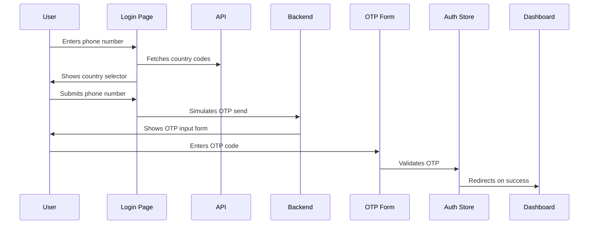
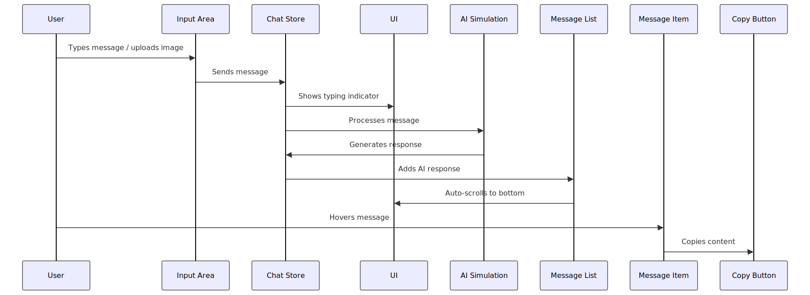

# Application Workflow

## 1. Authentication Flow

## 2. Dashboard Interaction

## 3. Chat System

## 4. State Management Flow

Key Features Implementation

    Infinite Scroll: Uses react-intersection-observer to detect when user scrolls to top

    AI Simulation: setTimeout with throttling to simulate "thinking" time

    Image Upload: FileReader API to convert images to base64 for preview

    Dark Mode: CSS variables + localStorage persistence

    Form Validation: React Hook Form + Zod schema validation

    Responsive Design: Tailwind's responsive utility classes
