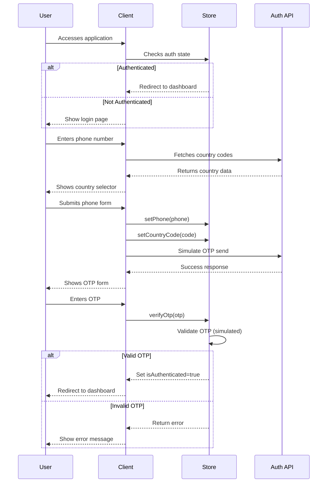

# Authentication Flow

## Sequence Diagram



```
Key Features

    Country Code Selection:

        Fetches from REST Countries API

        Dynamic dropdown with search

        Local caching of country data

    Form Validation:

        Phone number: 10-15 digits

        OTP: Exactly 6 digits

        Real-time validation feedback

        Schema validation with Zod

    OTP Simulation:

        setTimeout-based simulation

        No backend required

        Success/failure cases handled

    Security Considerations:

        No real SMS sent

        Client-side validation only (for demo)

        Production would require backend integration

Error Handling

    Invalid phone number format

    Invalid OTP format

    OTP verification failure

    Network errors (country fetch)
```
