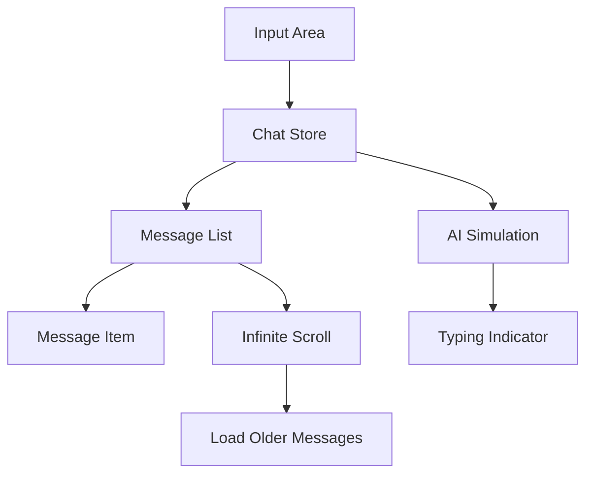

### 8. CHAT_SYSTEM.md

````markdown
# Chat System Design

## Architecture Overview


````

```
Key Features
1. Message Handling

    User Messages:

        Text or images

        Timestamped immediately

        Stored in Zustand store

    AI Responses:

        Simulated with setTimeout

        Throttled to mimic "thinking" time

        Typing indicator shown during delay

        Responses stored same as user messages

2. Image Uploads

    User selects image file

    FileReader converts to base64

    Preview shown before sending

    Base64 string stored with message

    Displayed as inline image

3. Infinite Scroll

    react-intersection-observer detects top of list

    Triggers loadMoreMessages action

    Simulates fetching older messages

    Appends to beginning of message list

    Maintains scroll position

4. UI Enhancements

    Auto-scroll: New messages trigger scroll to bottom

    Copy Functionality: Copy button on message hover

    Timestamps: Formatted with date-fns

    Typing Indicators: Visual cue for AI responses

    Skeleton Loaders: For initial message loading

Performance Considerations

    Virtualized Lists: For large message histories

    Memoization: React.memo for message items

    Throttling: AI responses to prevent flooding

    Base64 Optimization: Images stored as preview URLs

    Paginated Loading: Only load visible messages
```
