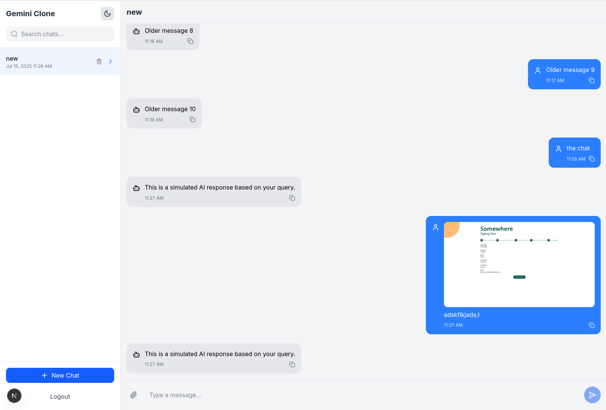

# Gemini Clone - Frontend Assignment



A fully functional, responsive frontend clone of a Gemini-style conversational AI chat application built for Kuvaka Tech's frontend developer assignment.

## Features

- ✅ OTP-based authentication with country code selection
- ✅ Chatroom management (create, delete, search)
- ✅ Real-time chat interface with typing indicators
- ✅ AI response simulation with throttling
- ✅ Image upload and preview
- ✅ Infinite scroll message loading
- ✅ Copy-to-clipboard functionality
- ✅ Dark/light mode toggle
- ✅ Responsive design for all devices
- ✅ Toast notifications for user actions

## Live Demo

[View Live Demo on Vercel](https://gemini-clone-kuvaka.vercel.app)

## Tech Stack

- **Framework**: Next.js 15 (App Router)
- **State Management**: Zustand
- **Form Handling**: React Hook Form + Zod
- **Styling**: Tailwind CSS
- **UI Components**: Shadcn UI + Lucide Icons
- **Notifications**: react-hot-toast
- **Date Formatting**: date-fns
- **Deployment**: Vercel

## Project Structure

```bash
src/
├── app/                   # Application routes
├── components/            # Reusable components
├── hooks/                 # Custom React hooks
├── lib/                   # Libraries and utilities
├── types/                 # TypeScript type definitions
├── styles/                # Global styles
└── public/                # Static assets
```

## Getting Started

### Clone the repository:

#### bash

git clone https://github.com/shashankdoeshisstuff/gemini_clone.git

cd gemini-clone

### Install dependencies:

#### bash

npm install

### Start the development server:

#### bash

npm run dev

# Documentation

## Project Structure

## Tech Stack Details

## Application Workflow

## State Management

## Component Architecture

## Authentication Flow

## Chat System Design

## Deployment Guide
